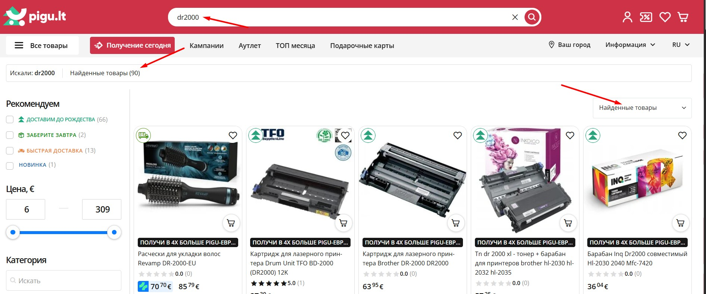
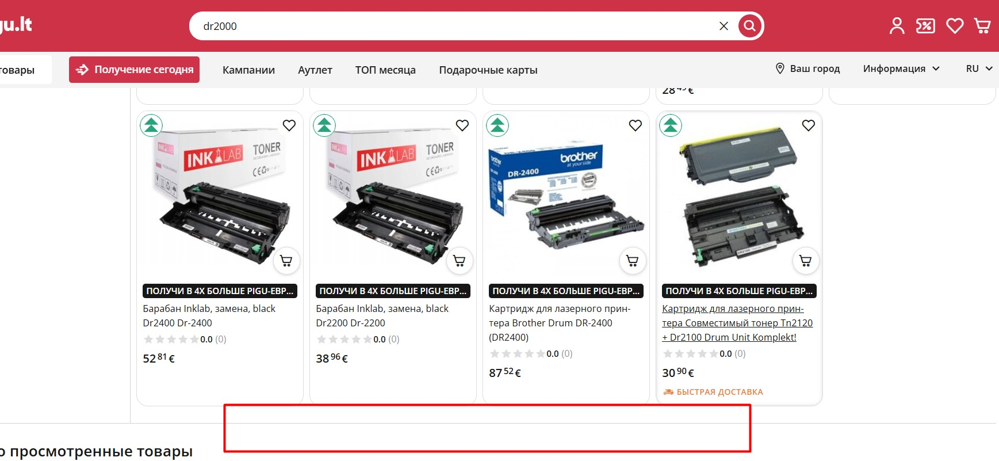
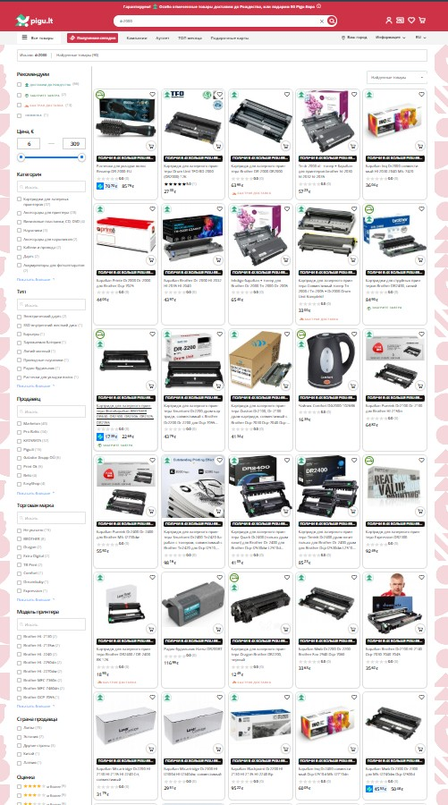
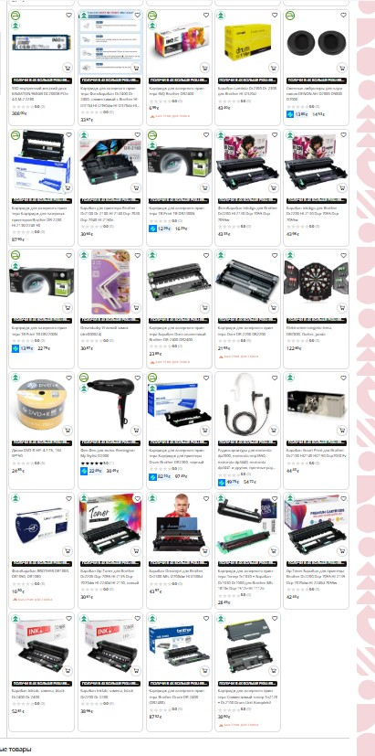
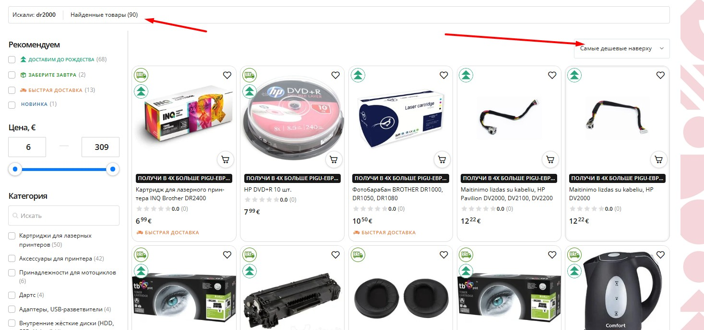

# **PIGU-S-001 Search results: отсутствует пагинация при большом количестве найденных товаров при использовании фильтра по умолчанию "Найденные товары"**

## **Summary**
Отсутствует пагинация при большом количестве найденных товаров в поиске — отображается только часть списка (59 из 90) Не зависит от выбранного языка.

---

## **Project**
Pigu.lt

## **Component**
Search

## **Version**
—

## **Severity**
S3 — Major

## **Priority**
P2 — Medium

---

# **Description**

## **Environment**
- Web version  
- Browsers: Chrome, Opera, Firefox  
- URL: https://pigu.lt/ru/sq?q=dr2000

---

## **Steps to Reproduce**
1. Перейти по ссылке: https://pigu.lt/ru/sq?q=dr2000  
2. Дождаться загрузки страницы (при необходимости выбрать нужный язык).  
3. Проверить блок количества найденных товаров - отображается **90 товаров**.  
4. Проскроллить страницу вниз.  
5. Обратить внимание, что отображается только **59 товаров**.  
6. Проверить отсутствие элементов навигации:  
   - пагинации  
   - кнопки “Показать ещё”  
   - автоподгрузки  
7. Применить один из доступных фильтров: "Самые дешевые наверху", "Самые дорогие наверху".  
8. Убедиться, что пагинация, при применных фильтрах **появляется**.  
9. Сбросить фильтры обратно к состоянию "Найденные товары".  
10. Пагинация снова исчезает, отображается только 59 товаров.

---

## **Expected Result**
- Все найденные товары (90) должны быть доступны для просмотра.  
- Пагинация должны быть доступны вне зависимости от выбранной сортировки.  
- Количество отображаемых карточек должно соответствовать количеству найденных товаров.

---

## **Actual Result**
- На странице отображается только **59** товаров.  
- Пагинация отсутствует.  
- Пагинация появляется только при применении фильтров, но исчезает при выборе «Найденные товары».

---

## **Attachments**
90 найденных товаров, фильтр "Найденные товары"

Пагинация отсутствует

  

  

Тот же запрос с фильтром "Самые дешевые наверху"

Пагинация присутствует

